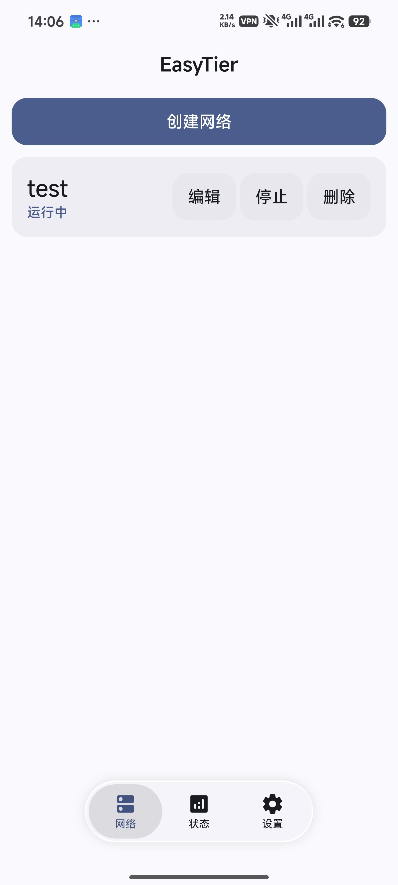
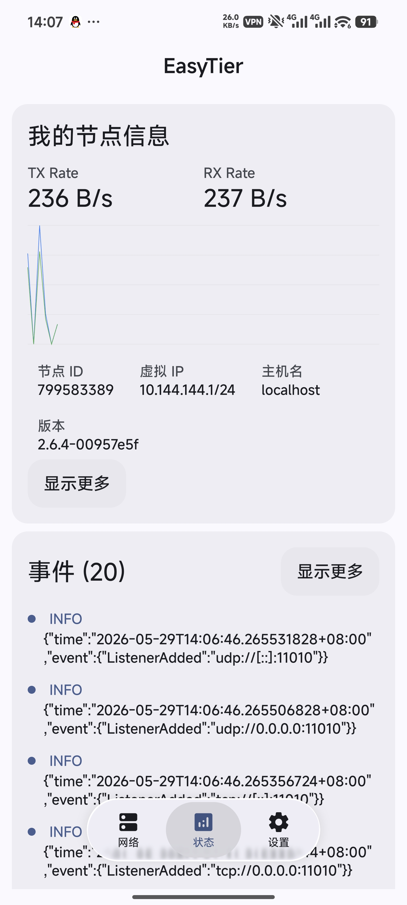
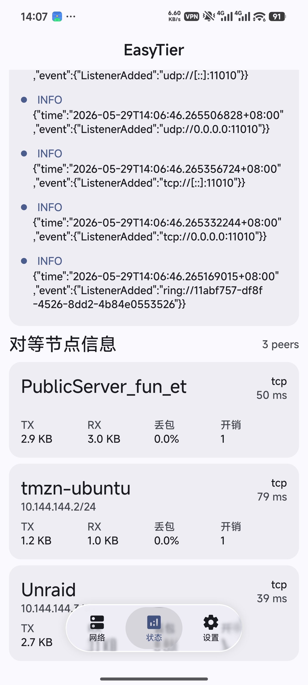

# EasyTier miuix

<div align="center">


EasyTier Android 客户端，基于 Kotlin Jetpack Compose + miuix 组件库构建

[](LICENSE)
[](https://developer.android.com)
[](https://kotlinlang.org)

</div>

## 简介

EasyTier miuix 是 [EasyTier](https://github.com/EasyTier/EasyTier) 的原生 Android 客户端，提供网络配置管理、运行状态监控、VPN 服务等功能。UI 采用 miuix 组件库，支持主题定制、液态玻璃效果和语言切换。

## 功能

- **网络管理** — 创建、编辑、删除网络配置，支持 Peer、Listener、Proxy CIDR 等完整配置
- **运行监控** — 实时查看节点信息、对等连接、流量图表和事件日志
- **VPN 服务** — 基于 Android VpnService 集成 EasyTier 核心的路由代理
- **主题定制** — Monet 动态取色、深色/浅色模式、主题色自定义
- **液态玻璃** — 悬浮胶囊底栏，支持 vibrancy + 高斯模糊 + 折射 lens 效果
- **语言切换** — 支持中文/英文/跟随系统

## 截图

<div align="center">
<table>
<tr>
<td></td>
<td></td>
<td></td>
</tr>
<tr>
<td align="center">网络列表</td>
<td align="center">状态监控</td>
<td align="center">事件日志</td>
</tr>
</table>
</div>

## 技术栈

| 层 | 技术 |
|---|---|
| UI | Jetpack Compose + miuix 0.9.1 |
| 语言 | Kotlin 2.3.21 |
| 架构 | MVVM + Repository |
| DI | Hilt 2.59.2 |
| 构建 | Gradle + AGP 8.13.2 |
| 后端 | EasyTier Rust 核心 (JNI) |

## 构建

### 环境要求

- Android Studio Hedgehog+
- JDK 17
- Android SDK 37
- Rust (用于编译原生库)

### 编译原生库

```bash
cd easytier-build
./build-android.sh
```

### 构建 APK

```bash
# Debug
./gradlew assembleDebug

# Release (需配置签名)
./gradlew assembleRelease
```

### 签名配置

创建 `keystore.properties` 文件：

```properties
storeFile=easytier-release.jks
storePassword=<your_password>
keyAlias=<your_alias>
keyPassword=<your_password>
```

## 项目结构

```
app/src/main/java/top/easytier/miuix/
├── MainActivity.kt              # 入口 Activity
├── EasyTierApp.kt               # Hilt Application
├── data/
│   ├── model/                   # 数据模型
│   │   ├── NetworkConfig.kt     # 网络配置
│   │   └── PeerInfo.kt          # 节点/对等信息
│   └── repository/              # 数据仓库
│       ├── NetworkRepository.kt # 接口定义
│       └── RealNetworkRepository.kt  # 实现（含 TOML 生成、VPN 管理）
├── jni/
│   ├── EasyTierJNI.kt           # JNI 绑定
│   ├── EasyTierVpnService.kt    # Android VPN Service
│   └── EasyTierManager.kt       # 网络生命周期管理
└── ui/
    ├── AppNavigation.kt         # 主导航（底栏 + 返回手势）
    ├── theme/                   # 主题（ColorMode / AppTheme）
    ├── components/              # 通用组件
    │   ├── FloatingBottomBar.kt # 悬浮底栏（液态玻璃）
    │   ├── liquid/              # 液态玻璃效果
    │   │   ├── Lens.kt          # SDF 折射着色器
    │   │   ├── Vibrancy.kt      # 饱和度增强
    │   │   └── InnerShadow.kt   # 内阴影
    │   ├── animation/           # 动画
    │   │   ├── DampedDragAnimation.kt    # 物理拖拽动画
    │   │   └── InteractiveHighlight.kt   # 触摸高光
    │   ├── ListenerPicker.kt    # 监听地址选择器
    │   └── UrlListInput.kt      # URL 列表输入
    ├── screens/
    │   ├── networks/            # 网络列表
    │   ├── config/              # 网络编辑
    │   ├── status/              # 状态监控
    │   └── settings/            # 设置 + 主题
    └── dialogs/                 # 对话框
        ├── AboutDialog.kt
        └── LanguageSwitcherDialog.kt
```

## 致谢

- [EasyTier](https://github.com/EasyTier/EasyTier) — 核心网络引擎
- [miuix](https://github.com/compose-miuix-ui/miuix) — Compose 组件库
- [SukiSU-Ultra](https://github.com/SukiSU-Ultra/SukiSU-Ultra) — 液态玻璃效果参考
- [AndroidLiquidGlass](https://github.com/Kyant0/AndroidLiquidGlass) — 透镜折射着色器

## 许可证

本项目基于 [Apache License 2.0](LICENSE) 开源。
