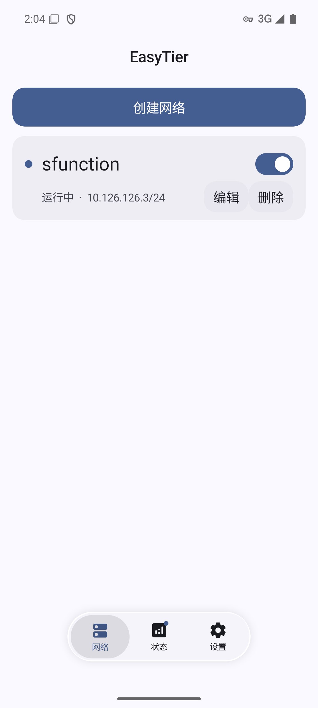
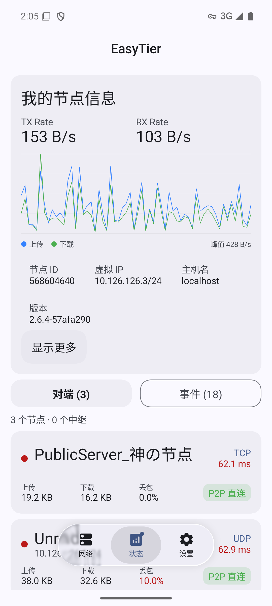
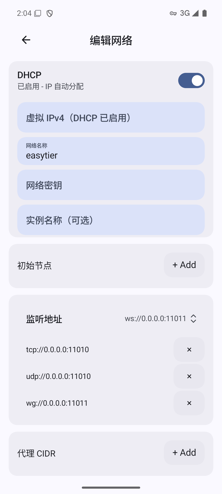
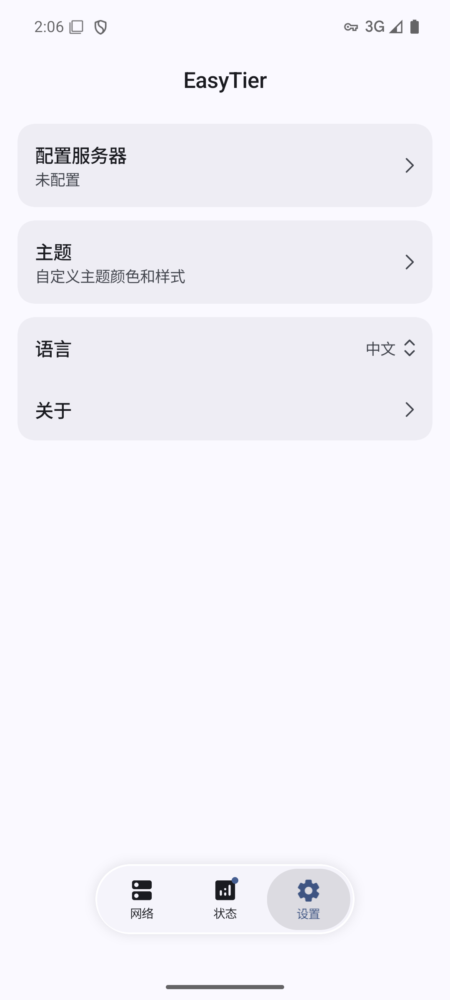

# EasyTier miuix

<div align="center">


EasyTier Android 客户端，基于 Kotlin Jetpack Compose + miuix 组件库构建

[](LICENSE)
[](https://developer.android.com)
[](https://kotlinlang.org)

</div>

## 简介

EasyTier miuix 是 [EasyTier](https://github.com/EasyTier/EasyTier) 的原生 Android 客户端，内置 EasyTier 2.7.0 核心（Rust/JNI），提供网络配置管理、运行状态监控与 VPN 服务。UI 采用 miuix 组件库，支持主题定制、液态玻璃效果和中英文切换。

## 功能

- **一键启停** — 网络卡片开关式启停，支持快捷设置磁贴（Quick Settings Tile）一键控制
- **网络管理** — 创建、编辑、删除网络配置，支持 Peer、Listener（对齐上游的 7 种协议：TCP/UDP/WG/QUIC/WS/WSS/FakeTCP）、Proxy CIDR、出口节点、SOCKS5、端口转发、ACL 等
- **运行监控** — 实时流量图表与速率、对端连接（P2P/中继标识、延迟、丢包）、事件日志（人性化展示，支持级别过滤）
- **VPN 服务** — 基于 Android VpnService 的前台服务，集成 EasyTier 核心的 TUN 路由代理
- **配置服务器** — 连接 easytier-web 配置服务器，远程下发的网络由核心自动应用
- **主题定制** — Monet 动态取色、深色/浅色模式、主题色自定义
- **液态玻璃** — 悬浮胶囊底栏，支持 vibrancy + 高斯模糊 + 折射 lens 效果
- **语言切换** — 支持中文/英文/跟随系统

## 截图

<div align="center">
<table>
<tr>
<td></td>
<td></td>
</tr>
<tr>
<td align="center">网络列表</td>
<td align="center">状态监控</td>
</tr>
<tr>
<td></td>
<td></td>
</tr>
<tr>
<td align="center">网络配置</td>
<td align="center">设置</td>
</tr>
</table>
</div>

## 技术栈

| 层 | 技术 |
|---|---|
| UI | Jetpack Compose + miuix 0.9.3 |
| 语言 | Kotlin 2.3.21 |
| 架构 | MVVM + Repository |
| DI | Hilt 2.59.2 |
| 构建 | Gradle + AGP 8.13.2 |
| 后端 | EasyTier 2.7.0 Rust 核心 (JNI) |

## 构建

### 环境要求

- Android Studio Hedgehog+
- JDK 17
- Android SDK 37
- Rust（用于编译原生库，需 `aarch64-linux-android` target）
- protoc（编译 Rust 原生库时需要，通过 `PROTOC` 环境变量指定）

### 编译原生库

```bash
cd easytier-build/easytier-contrib/easytier-android-jni
cargo ndk -t arm64-v8a build --release
cp target/aarch64-linux-android/release/libeasytier_android_jni.so ../../../../app/src/main/jniLibs/arm64-v8a/
```

核心已静态链接进 `libeasytier_android_jni.so`（仅导出 JNI 符号），无需单独的 `libeasytier_ffi.so`。

### 构建 APK

```bash
# Debug
./gradlew assembleDebug

# Release (需配置签名)
./gradlew assembleRelease
```

### 签名配置

创建 `keystore.properties` 文件：

```properties
storeFile=easytier-release.jks
storePassword=<your_password>
keyAlias=<your_alias>
keyPassword=<your_password>
```

## 项目结构

```
app/src/main/java/
├── com/easytier/jni/
│   └── EasyTierJNI.kt           # JNI 绑定（对齐上游 android-jni 接口）
└── top/easytier/miuix/
    ├── MainActivity.kt          # 入口 Activity
    ├── EasyTierApp.kt           # Hilt Application
    ├── data/
    │   ├── model/               # 数据模型
    │   │   ├── NetworkConfig.kt # 网络配置
    │   │   └── PeerInfo.kt      # 节点/对等信息
    │   └── repository/
    │       ├── NetworkRepository.kt     # 接口定义
    │       └── RealNetworkRepository.kt # 实现（TOML 生成、VPN 管理、配置服务器）
    ├── jni/
    │   ├── EasyTierVpnService.kt   # Android VPN 前台服务
    │   ├── EasyTierTileService.kt  # 快捷设置磁贴
    │   └── EasyTierManager.kt      # 网络生命周期管理
    └── ui/
        ├── AppNavigation.kt     # 主导航（底栏 + 返回手势）
        ├── theme/               # 主题（ColorMode / AppTheme）
        ├── components/          # 通用组件
        │   ├── FloatingBottomBar.kt # 悬浮底栏（液态玻璃）
        │   ├── PressFeedback.kt     # 按压反馈/触控规格组件
        │   ├── ListenerPicker.kt    # 监听地址选择器（上游协议全集）
        │   ├── TrafficChart.kt      # 流量图表
        │   └── ...
        ├── screens/
        │   ├── networks/        # 网络列表
        │   ├── config/          # 网络编辑
        │   ├── status/          # 状态监控（事件/对端 TabRow 切换）
        │   └── settings/        # 设置 + 主题
        └── dialogs/             # 对话框
```

## 致谢

- [EasyTier](https://github.com/EasyTier/EasyTier) — 核心网络引擎
- [miuix](https://github.com/compose-miuix-ui/miuix) — Compose 组件库
- [SukiSU-Ultra](https://github.com/SukiSU-Ultra/SukiSU-Ultra) — 液态玻璃效果参考
- [AndroidLiquidGlass](https://github.com/Kyant0/AndroidLiquidGlass) — 透镜折射着色器
- [ui-skills](https://www.ui-skills.com/) — UI 设计工程规范参考

## 许可证

本项目基于 [Apache License 2.0](LICENSE) 开源。
